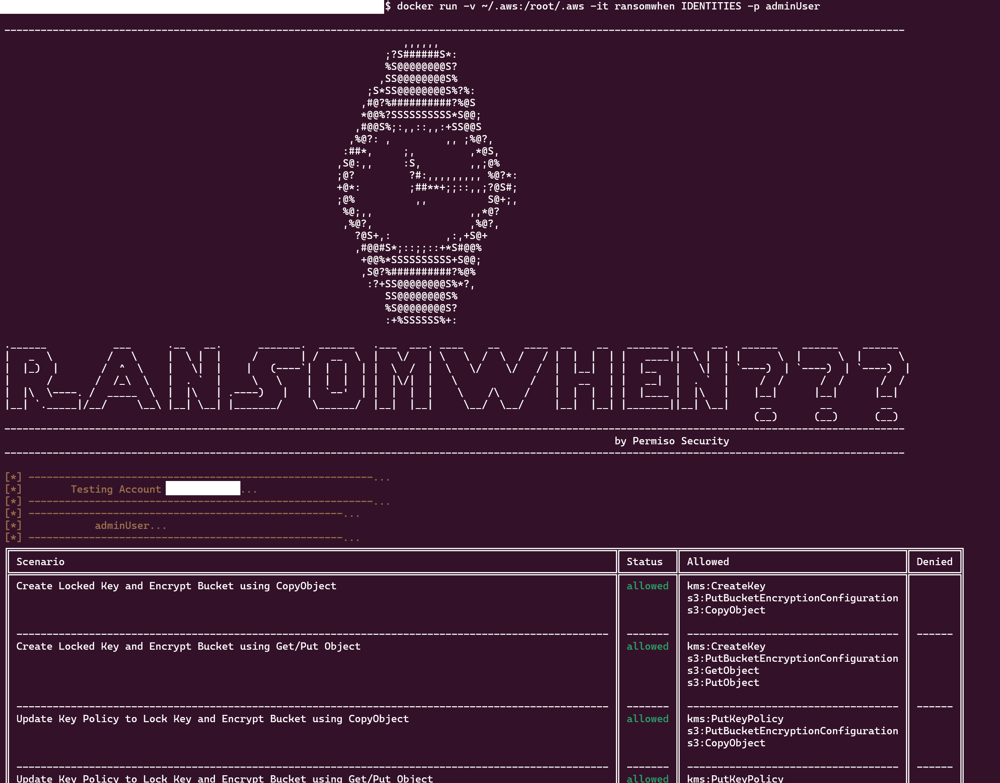
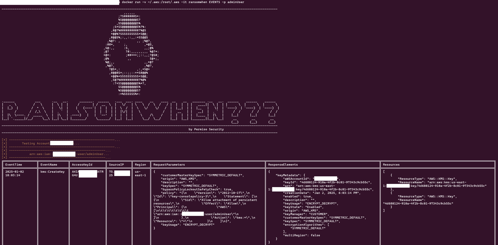

# RansomWhen


**Associated Blog**: [RansomWhen??? I never even notice it…](https://permiso.io/blog/ransomwhen-i-did-not-even-notice-it)\
**Research Blog**: [Encrypting buckets for compliance and ransom - How Attackers Can Use KMS to Ransomware S3 Buckets](https://blog.pepperclipp.com/pepperclipp-public/encrypting-buckets-for-compliance-and-ransom-how-attackers-can-use-kms-to-ransomware-s3-buckets)

----------------------------------------------------------------------------------

RansomWhen is a tool to enumerate identities that can lock S3 Buckets using KMS, resulting in ransomwares,
as well as detect occurances of S3 Ransomwares using KMS
````
-----------------------------------------------------------------------------------------------------------------------------------------------------
                                                                  ,,,,,,
                                                               ;?S######S*:
                                                               %S@@@@@@@@S?
                                                              ,SS@@@@@@@@S%
                                                            ;S*SS@@@@@@@@S%?%:
                                                           ,#@?%##########?%@S
                                                           *@@%?SSSSSSSSSS*S@@;
                                                          ,#@@S%;:,,::,,:+SS@@S
                                                         ,%@?: ,         ,, ;%@?,
                                                        :##*,     ;,         ,*@S,
                                                       ,S@:,,     :S,        ,,;@%
                                                       ;@?         ?#:,,,,,,,,, %@?*:
                                                       +@*:        ;##**+;;::,,;?@S#;
                                                       ;@%          ,,          S@+;,
                                                        %@;,,                ,,*@?
                                                        ,%@?,                ,%@?,
                                                          ?@S+,:         ,:,+S@+
                                                          ,#@@#S*;::;;::+*S#@@%
                                                           +@@%*SSSSSSSSSS+S@@;
                                                           ,S@?%##########?%@%
                                                            :?+SS@@@@@@@@S%*?,
                                                               SS@@@@@@@@S%
                                                               %S@@@@@@@@S?
                                                               :+%SSSSSS%+:

.______           ___      .__   __.      _______.  ______   .___  ___. ____    __    ____  __    __   _______ .__   __.  ______    ______    ______
|   _  \         /   \     |  \ |  |     /       | /  __  \  |   \/   | \   \  /  \  /   / |  |  |  | |   ____||  \ |  | |      \  |      \  |      \
|  |_)  |       /  ^  \    |   \|  |    |   (----`|  |  |  | |  \  /  |  \   \/    \/   /  |  |__|  | |  |__   |   \|  | `----)  | `----)  | `----)  |
|      /       /  /_\  \   |  . `  |     \   \    |  |  |  | |  |\/|  |   \            /   |   __   | |   __|  |  . `  |     /  /      /  /      /  /
|  |\  \----. /  _____  \  |  |\   | .----)   |   |  `--'  | |  |  |  |    \    /\    /    |  |  |  | |  |____ |  |\   |    |__|      |__|      |__|
|__| `._____|/__/     \__\ |__| \__| |_______/     \______/  |__|  |__|     \__/  \__/     |__|  |__| |_______||__| \__|     __        __        __
                                                                                                                            (__)      (__)      (__)
-----------------------------------------------------------------------------------------------------------------------------------------------------
                                                                                                     by Permiso Security
-----------------------------------------------------------------------------------------------------------------------------------------------------
````
## Installation
### Local Installation
To install, the only thing needed, is to install the required libraries.
````
python3 -m venv ./venv
source venv/bin/activate
python3 -m pip install -r requirements.txt
````
Then, just run the tool by running **ransomwhen.py**:
````
usage: ransomwhen.py [-h] {IDENTITIES,EVENTS} ...

RansomWhen???

positional arguments:
  {IDENTITIES,EVENTS}  Select the check on the account (the choices are IDENTITIES, EVENTS)
    IDENTITIES         IDENTITIES specific arguments
    EVENTS             EVENTS specific arguments

options:
  -h, --help           show this help message and exit
````
### Docker
A Dockerfile is placed inside the main directory of the project. To build the image, inside the main directory of the project run:
````
docker build -t ransomwhen .
````
Then run the container with directory **~/.aws** mounted to host:
````
usage: ransomwhen.py [-h] {IDENTITIES,EVENTS} ...

RansomWhen???

positional arguments:
  {IDENTITIES,EVENTS}  Select the check on the account (the choices are IDENTITIES, EVENTS)
    IDENTITIES         IDENTITIES specific arguments
    EVENTS             EVENTS specific arguments

options:
  -h, --help           show this help message and exit
````

The tool has 2 nested Argument Parsers, IDENTITIES and EVENTS. IDENTITIES will list all identities with privileges to any of the ransomware scenarios and EVENTS will list malicious events related to ransomware per each identity.

## **Enumerating Identities**

To enumerate the identities, the tool will use the JSON Blob on path `scenarios/scenarios.json` containing the privileges needed for different attacks. That JSON is configurable with the below format. Each scenario will have a name and a list of events to check.

```json
{
    "Create Locked Key and Encrypt Bucket using CopyObject": [
        "kms:CreateKey",
        "s3:PutBucketEncryptionConfiguration",
        "s3:CopyObject"
    ]
}
```

Each scenario will be listed as:

- **allowed**, for cases when all the events in a scenario are allowed
- **partially**, for cases when at least 1 event in the scenario is allowed
- **denied**, for cases when no event on the scenario is allowed



```
Attach Custom KMS Key Store
Create Locked Key and Encrypt Bucket using CopyObject
Create Locked Key and Encrypt Bucket using Get/Put Object
Create Role, Add Inline Policy and Delete
Create Role, Attach Inline Policy and Delete
Create User, Add Inline Policy and Delete
Create User, Attach Inline Policy and Delete
Delete CloudTrail Trail
Stop Logging
Stop Logging using KMS
Update Current Custom KMS Key Store
Update Key Policy to Lock Key and Encrypt Bucket using CopyObject
Update Key Policy to Lock Key and Encrypt Bucket using Get/Put Object
```

## **Finding malicious events**

As far as finding identities with malicious events, the tool will look into the JSON Blob `scenarios/events.json`. That file can also be configured, with a format as below, where each event will have its information set to either null or a value, just as it is supposed to be saved on the CloudTrail Logs.

```json
{
  "CreateKey": {
    "UserAgent": null,
    "Identity": null,
    "RequestParameters": null,
    "ResponseElements": null,
    "ErrorCode": null,
    "ErrorMessage": null,
    "EventSource": "kms.amazonaws.com"
  }
}
```

The events below are the ones that will get checked on CloudTrail. And as seen before, each event can be configured to check for specific indicators.

```
kms:CreateKey
kms:PutKeyPolicy
kms:ReEncrypt
kms:CreateCustomKeyStore
kms:UpdateCustomKeyStore
kms:ConnectCustomKeyStore
kms:DisconnectCustomKeyStore
kms:DeleteCustomKeyStore
s3:PutBucketEncryptionConfiguration
s3:CopyObject
s3:PutObject
s3:GetObject
iam:CreateUser
iam:DeleteUser
iam:CreateRole
iam:DeleteRole
iam:AttachUserPolicy
iam:PutUserPolicy
iam:AttachRolePolicy
iam:PutRolePolicy
cloudtrail:StopLogging
cloudtrail:DeleteTrail
cloudtrail:UpdateTrail
```

Then,  running the tool, would list all the identities (IAM Users and Roles) and the events they have ran over the last 90 days.


# Output
The outputs will be dumped on the **output** directory. Each AWS Account will have its own directory and the CSV files of each identity will be saved there:
````
ls output/ -R
output/:
012345678912

output/012345678912:
adminUser-predefined-scenarios.csv adminUser-events.csv
````

### Tests
The tool will test for attacks provided on **./scenarios/scenarios.json**:
````
cat ./scenarios/scenarios.json
[
    "Create Locked Key and Encrypt Bucket using CopyObject": [
        "kms:CreateKey",
        "s3:PutBucketEncryptionConfiguration",
        "s3:CopyObject"
    ],
    ...
]
````
Each attack has a name and a list of privileges. New scenarios can be added or existing ones can be modified on the JSON and they will be automatically executed by the tool.

The malicious events are stored on ./scenarios/events.json and each have their options to filter:
```
[
    "CreateKey": {
        "UserAgent": null,
        "Identity": null,
        "RequestParameters": null,
        "ResponseElements": null,
        "ErrorCode": null,
        "ErrorMessage": null,
        "EventSource": "kms.amazonaws.com"
    }
    ...
] 
```
