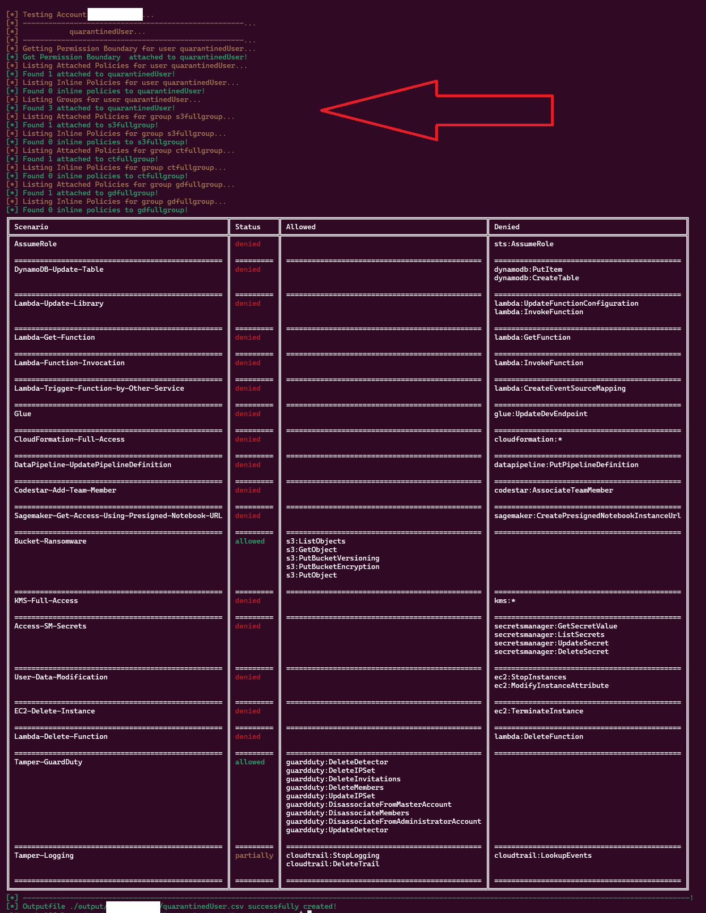

# DetentionDodger


Associated Blog: [Breaking free from the chains of fate - Bypassing AWSCompromisedKeyQuarantineV2 Policy](https://permiso.io/blog/introducing-detention-dodger)\
\
Conferences Where the tool was presented:
- **SecTor Arsenal 2024** (https://www.blackhat.com/sector/2024/arsenal/schedule/index.html#detentiondodger-finding-rusted-links-on-the-chains-of-fate-43392)
- **SANS Pentest Hackfest Hollywood 2024** (https://www.sans.org/cyber-security-training-events/hackfest-summit-2024/)

----------------------------------------------------------------------------------

DetentionDodger is a tool designed to find users whose credentials have been leaked/compromised and the impact they have on the target
````

                                                                                          .-'''-.
_______                                                                                  '   _    \
\  ___ `'.         __.....__                    __.....__        _..._            .--. /   /` '.   \    _..._
 ' |--.\  \    .-''         '.              .-''         '.    .'     '.          |__|.   |     \  '  .'     '.
 | |    \  '  /     .-''"'-.  `.      .|   /     .-''"'-.  `. .   .-.   .     .|  .--.|   '      |  '.   .-.   .
 | |     |  '/     /________\   \   .' |_ /     /________\   \|  '   '  |   .' |_ |  |\    \     / / |  '   '  |
 | |     |  ||                  | .'     ||                  ||  |   |  | .'     ||  | `.   ` ..' /  |  |   |  |
 | |     ' .'\    .-------------''--.  .-'\    .-------------'|  |   |  |'--.  .-'|  |    '-...-'`   |  |   |  |
 | |___.' /'  \    '-.____...---.   |  |   \    '-.____...---.|  |   |  |   |  |  |  |               |  |   |  |
/_______.'/    `.             .'    |  |    `.             .' |  |   |  |   |  |  |__|               |  |   |  |
\_______|/       `''-...... -'      |  '.'    `''-...... -'   |  |   |  |   |  '.'                   |  |   |  |
                                    |   /                     |  |   |  |   |   /                    |  |   |  |
                                    `'-'                      '--'   '--'   `'-'                     '--'   '--'
                                                                   .-'''-.
                                                  _______         '   _    \ _______
                                                  \  ___ `'.    /   /` '.   \\  ___ `'.                 __.....__
                                                   ' |--.\  \  .   |     \  ' ' |--.\  \    .--./)  .-''         '.
                                                   | |    \  ' |   '      |  '| |    \  '  /.''\\  /     .-''"'-.  `. .-,.--.
                                                   | |     |  '\    \     / / | |     |  '| |  | |/     /________\   \|  .-. |
                                                   | |     |  | `.   ` ..' /  | |     |  | \`-' / |                  || |  | |
                                                   | |     ' .'    '-...-'`   | |     ' .' /("'`  \    .-------------'| |  | |
                                                   | |___.' /'                | |___.' /'  \ '---. \    '-.____...---.| |  '-
                                                  /_______.'/                /_______.'/    /'""'.\ `.             .' | |
                                                  \_______|/                 \_______|/    ||     ||  `''-...... -'   | |
                                                                                           \'. __//                   |_|
                                                                                            `'---'
                                                                                                     by Permiso Security
------------------------------------------------------------------------------------------------------------------------------
````
## Installation
### Local Installation
To install, the only thing needed, is to install the required libraries.
````
python3 -m venv ./venv
source venv/bin/activate
python3 -m pip install -r requirements.txt
````
Then, just run the tool by running **detentiondodger.py**:
````
usage: DetentionDodger [-h] [-p PROFILE]

DetentionDodger is a tool designed to find users whose credentials have been leaked/compromised and the impact they have on the target

options:
  -h, --help            show this help message and exit
  -p PROFILE, --profile PROFILE
                        The AWS Profile Name to authenticate as. Default is 'default'. The credentials need to have access to iam:ListUsers, iam:ListUserPolicies,
                        iam:ListAttachedUserPolicies, iam:ListGroupsForUser, iam:ListGroupPolicies, iam:ListAttachedGroupPolicies, cloudtrail:LookupEvents,
                        iam:GetPolicyVersion, iam:GetPolicy
````
### Docker
A Dockerfile is placed inside the main directory of the project. To build the image, inside the main directory of the project run:
````
docker build -t detentiondodger .
````
Then run the container with directories **output** and **~/.aws** mounted to host:
````
docker run -v ~/.aws:/root/.aws -v ./output:/detentiondodger/output -it detentiondodger -h
usage: DetentionDodger [-h] [-p PROFILE]

DetentionDodger is a tool designed to find users whose credentials have been leaked/compromised and the impact they have on the target

options:
  -h, --help            show this help message and exit
  -p PROFILE, --profile PROFILE
                        The AWS Profile Name to authenticate as. Default is 'default'. The credentials need to have access to iam:ListUsers, iam:ListUserPolicies,
                        iam:ListAttachedUserPolicies, iam:ListGroupsForUser, iam:ListGroupPolicies, iam:ListAttachedGroupPolicies, cloudtrail:LookupEvents,
                        iam:GetPolicyVersion, iam:GetPolicy
````

## Usage
### Finding all quarantied Users
When no user is specified using **-u** flag, the tool will list all the users and find the ones that either have the Quarantine Policy Attached or attempted to have it attached, by looking at the CloudTrail Logs. Then it will list all the policies them and their groups have and check the privileges based on the scenarios found on the scenarios directory.


### Checking specific user
A user can be specified using **-u** flag. In that case, the check for the Quarantine Policy will not be done and the user will be checked only for the Privileges it has.


### Output
The outputs will be dumped on the **output** directory. Each AWS Account will have its own directory and the CSV files of each user will be saved there:
````
ls output/ -R
output/:
012345678912

output/012345678912:
adminUser.csv  quarantinedUser.csv
````

### Tests
The tool will test for attacks provided on **./scenarios/scenarios.json**:
````
cat ./queries/queries.json
[
    "AssumeRole": [
        "sts:AssumeRole"
    ],
    ...
]
````
Each attack has a name and a list of privileges. New scenarios can be added or existing ones can be modified on the JSON and they will be automatically executed by the tool.

